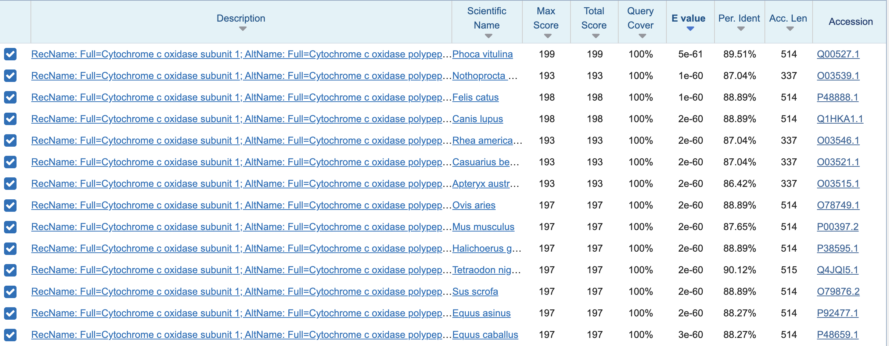

```{=html}
<!--
Before you push, check:
  [ ] this .qmd AND its rendered .html are both committed
  [ ] rendered from a clean session (Session > Restart R, then Render)
  [x] paths are relative, not absolute: from notebooks/, use ../ (e.g. ../output/weekNN/)
  [x] tables and figures are saved under output/weekNN/, not only printed here
  [x] nothing under data/raw/ is committed
  [x] software, platform, and container/environment are named
  [ ] the commit link is posted as a comment on your Project Proposal issue
Rubric: https://sr320.github.io/course-fish546-2026/how-we-work.html#weekly-entry-rubric
-->
```
## 1. This week's analysis

```         
platform: x86_64-pc-linux-gnu Raven
R version: 4.2.3 (2023-03-15)
```

I first tried this out in Raven using the NCBI blast workflow from GitHub, then I also tried out using the NCBI web blast to see if I was getting the same results. For both, I used the swissprot database. Information on query length and other info can be seen in the screenshot below of the NCBI search I did on the web.

```{bash}
cd ~/Dailey-546/code
#cd changes the directory i'm currently in, I want to put the ncbi workflow script in code

git clone https://github.com/sr320/workflow-annotation.git #then this code just borrows the NCBI blast workflow from GitHub

cd workflow-annotation
ls #lists files in the directory I'm currently in, making sure i did everything right.

bash blast2slim.sh -i example_transcripts.fasta --threads 2 -o test #test to see if the script is working, it was but then was throwing errors about virtual python environment so the next few lines of code are me trying to fix that

python3 -m venv .venv
source .venv/bin/activate
source .venv/bin/activate

python -m pip install pandas requests goatools matplotlib

bash blast2slim.sh -i query.fasta --threads 2 -o week01_annotation #it's working, now i can actually use the workflow script and generate a tsv 


```




Both the NCBI web blastx and the blastx using the script in Raven gave the same hits. The top hit was for a sequence that was a mitochondrial protein for *Phoca vitulina*, a harbor seal with \~89.5% similarity. This doesn't necessarily mean this is a harbor seal. What this does tell us, is the query unknown sequence likely includes the COI gene, and it is similar to a harbor seal. There is a chance it is a harbor seal, especially with the low E value. However, COI is also highly conserved across vertebrates, which makes the BLAST hits biologically make sense; there are several hits that how a low E value but hover in the 80-90ish percent identity range. The query sequence of COI is similar to many species just by nature of being conserved, so identity is pretty hard to nail down. I tried a few other databases, but didn't see any big jumps in percent identity or e-value that would make me think it might be better.

## 2. Reflection questions

1.  What does BLAST compare, and what do percent identity, query coverage, and e-value each contribute?

BLAST takes a biological sequence, whether that's DNA, RNA, or protein, and compares it against a database of sequences to identify similarities or matches. This is a super useful tool for things like assigning taxonomy to nucleotide sequences. Percent identity, query coverage, and e-value are metrics that help the user better understand the nature and strength of the similarity between their query sequence and the BLAST hits. Percent identity is the percentage of aligned positions that are identical between the query sequence and the BLAST hit. Query coverage is the percentage of the query sequence that is included in the alignment with the database sequence. Lastly, the e-value, or "expectation value," estimates the number of matches with a similar or better alignment score that would be expected to occur by random chance when searching a database. A low e-value suggests that the match is statistically significant and unlikely to be due to chance.

2.  Why can the top BLAST hit be misleading?

A high percent identity, even at 100%, does not necessarily mean that the query sequence belongs to the species identified in the top BLAST hit. There are several other factors that need to be considered and scrutinized before making that determination. For example, a query sequence with 100% identity to *Phoca vitulina* does not automatically mean that the sequence belongs to a harbor seal. In this case, the query might only span 50 bp, leaving out a lot of potentially important information needed to confidently identify the species. The sequence could actually belong to another species within the genus *Phoca*, such as *Phoca largha* (spotted seal), that shares those exact 50 bp but has differences elsewhere in its DNA that would allow us to distinguish the two species. The e-value helps provide additional context by estimating how many matches with a similar or better alignment score could be expected by chance. A low e-value suggests that the match is statistically significant, but it does not necessarily confirm the species identity. This is why it's important to consider percent identity, query coverage, e-value, and whether other species have similarly strong matches before making a taxonomic assignment.

3.  What will be the endpoint of your quarter project if everything goes well?

The end point of my quarter project would be to have a repo that makes everything I have done for this project reproducible following all best data practices, this is something I'm really excited about and think will be extraordinarily helpful for my MS thesis. In terms of more concrete deliverables, ideally having my raw data initially processed (trimmed, merged, etc.) and then some figures that demonstrate differences between the two subpopulations, differences in diversity between anatomical sites on the same individual.

## 3. Project progress

With lots of help, my project data was downloaded into my repo on Raven. This is super exciting because now it's just waiting to be unzipped and messed around with!

## 4. Where I'm stuck

I struggled pretty hard with getting BLAST to run in Raven, but it just took some trouble shooting and patience. Essentially I was running blastn -remote and it was taking a really long time and just wasn't yielding any results. The code itself was working, but the issue was that I was waiting in a long queue. I had a help request [here](https://github.com/sr320/course-fish546-2026/issues/30) and got unstuck which is awesome, the fix was creating a local database so that I did not have to wait in the queue.

I also found myself working in the terminal to try out pieces of code first and to move around through directories before realizing I had moved myself all around without actually including that in my code, so that is something to work on.

## 5. Next week

I want to unzip (untar?) my files, run fastqc on my own sequencing data and identify how/where to trim the reads. After trimming, it would be great to merge and denoise since I think that will be the next step in getting my data ready for actual analysis!
